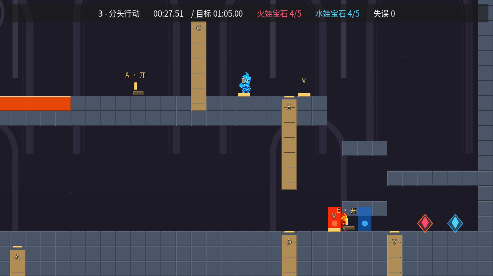
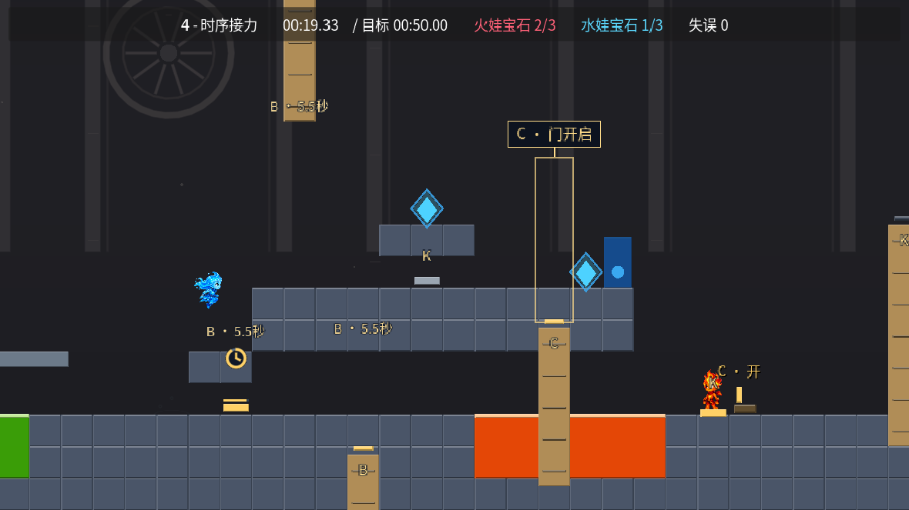
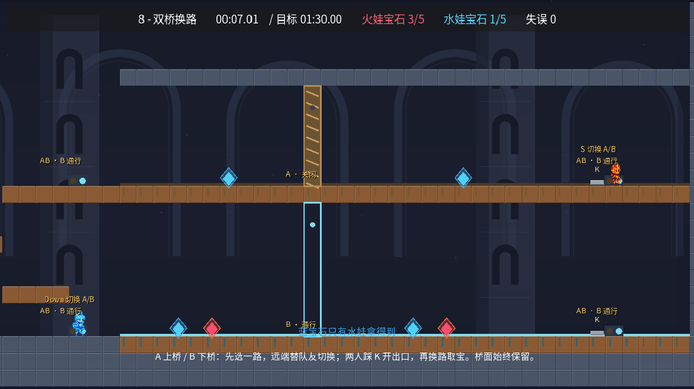
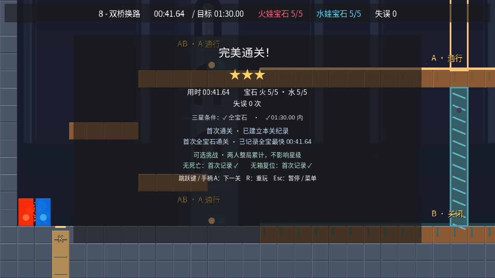

# 三关合作样板：第 3、4、8 关

本轮基于 master `9f9d2f96d64930d449753373e635d38cc25a9248`，先交付三种玩法供双人试玩。其余七关，包括第 7 关休息关，关卡数据与原始按键回放均保持不变。尚未推广到另外七关。

## 如何试玩

这是 Godot 4.6.3 / 4.7 完整源码包，需要对应 Godot 和 Python 3.9+。未附 Windows/macOS/Linux 独立导出程序。

正常入口仍是 `project.godot`，在 Godot 中 F5，或者 `godot --path .`。正常入口遵守原有解锁，保留未改七关的有效最佳纪录；三关旧布局的纪录不再参与比较，解锁不变。

想直接试玩样板、完全不改正式进度，在工程目录执行：

```sh
python tools/play_prototypes.py --godot /path/to/godot --level 3
python tools/play_prototypes.py --godot /path/to/godot --level 4
python tools/play_prototypes.py --godot /path/to/godot --level 8
```

Godot 已在 PATH 时省略 `--godot`。Windows 使用 Godot 的 `_console.exe`，路径含空格需加引号。

这个显式入口先导入工程，再在临时、独立的用户数据目录中启动所选关卡，并关闭进度记录。关闭游戏窗口结束；临时进度会自动清理。更换关卡时关闭当前窗口，再用另一条命令启动。Esc 暂停，R 重玩；从暂停返回普通菜单也仍属于这次隔离试玩，不会写入正式进度。不要在 Godot 中直接 F6 运行 `prototype_launch.tscn`，它要求由启动器建立隔离环境。

火娃 A/D 移动、W 跳、S 交互；水娃方向键左右移动、上键跳、下键交互。已有改键与双手柄映射保留。

## 三个样板的区别

### 第 3 关：交叉支援

保留最初的元素分路与 C→D→E 接力，在右端增加干燥的折返台阶。可以直接会合通关，也可以换到同伴原来的路线：水娃在上层守 D，让火娃取下层的红宝石；火娃再从下层守 C，让水娃取上层蓝宝石。宝库先取、后取都可行。新台阶漏跳落回安全地面，没有新增门链或机关类型。

### 第 4 关：离板后的倒计时交棒

新增可充能延时板 B：踩住时持续供电，离开后保留 6 秒，重新踩住补满。水娃离板回到台阶走上路，火娃走下路；高台蓝宝石是更紧凑的可选绕路。超时可在安全地面返回重踩。原来的 A 取箱换班与终点 K 双钥匙保留。

开关显示时钟、进度条与秒数，两个目标门也显示同一倒计时。B 门关闭前检查角色与箱子；有人挡住时保持开启并提示等待让行，不挤压角色。上门向上收起，避免伸入下路。

### 第 8 关：可逆双桥换路

原塔关改为两条永久桥面组成的 A/B 分路。A 开上桥、B 开下桥，四个操作台同步；上下桥远端彼此隔开，必须由同伴从另一端切换接应。两人同时到达远端 K 后，解锁出发侧出口，再反向帮助同伴回来。

两桥均有双色宝石，收全需要交换路线；A 先或 B 先都成立。切换改变的是通路入口，桥面一直存在。门里有角色/箱子、或有人站在将被打开的门顶时，切换会等待；再次交互可取消待切换。靠着已关闭的门不妨碍同伴替你打开。

## 真实按键证据与三星余量

所有下列通关使用新关卡实例、60 Hz 真实角色物理与 Input 动作。原始回放不改角色位置、速度、机关状态或宝石计数。

| 路线 | 秒数 | 宝石 | 死亡 / 箱复位 | 三星目标 |
|---|---:|---:|---:|---:|
| 第 3 关主全宝路线 | 31.50 | 5 红 + 5 蓝 | 0 / 0 | 65 秒 |
| 第 3 关宝库后取 | 31.52 | 5 + 5 | 0 / 0 | 65 秒 |
| 第 3 关漏跳台阶、提早离板后恢复 | 45.07 | 5 + 5 | 0 / 0 | 65 秒 |
| 第 4 关全宝路线 | 23.60 | 3 + 3 | 0 / 0 | 50 秒 |
| 第 4 关错过交箱、计时耗尽后恢复 | 32.90 | 3 + 3 | 0 / 0 | 50 秒 |
| 第 8 关 A 先 | 41.65 | 5 + 5 | 0 / 0 | 90 秒 |
| 第 8 关 B 先 | 47.85 | 5 + 5 | 0 / 0 | 90 秒 |
| 第 8 关走错关闭路线后接应恢复 | 42.93 | 5 + 5 | 0 / 0 | 90 秒 |

第 3 关还验证了不取支路宝石、宝库 V 不开时的直接通关。三星时间给予阅读、讨论与操作余量，尚未经过真人双人难度标定，不代表最优路线。

## 工程与测试要点

- 只增加两种可复用机关：延时板与可逆双路；未新增敌人、重力规则或液体物理
- 第 3/4/8 关内容修订分别变为 3/4/3；全局评分版本仍为 4。门槛随关卡内容修订一起隔离，未改七关的星级不被清空
- 倒计时暂停、重复充能、无效/死亡压板者清理、箱子恢复、待切换取消、角色和箱子的门内/门顶保护、场景销毁与重建均有定向断言
- 新通关回放检查最终游戏状态、完成事件、结算面板、内存纪录与实际隔离磁盘存档一致
- 新路线查出 ConfigFile 浮点尾数重新序列化的边界问题。保存校验先按同一解析器规范化预期内容，再作完整严格对比，避免约 10⁻¹⁵ 秒尾差误报保存失败；1,891 帧路线保留为回归
- 静态生成器对延时/互斥机关使用明确标注的几何上界模型，不能把它当合法计时或 A/B 顺序的证明；实际顺序由引擎原始回放和机关测试证明
- 第 3 关上层蓝宝石仍有静态模型的保守不可达警告；两种完整物理回放均实际取得。原先第 2/4/9 关的保守警告保留，没有删除警告来伪装通过
- 旧第 8 关电梯测试仅作为历史资料保留，不再对已替换的双桥布局执行；第 5 关原电梯反例继续执行，双桥使用新的两种顺序、误选恢复及堵门反例

完整入口：

```sh
python tools/run_checks.py --godot /path/to/godot
```

包含原有回归、新机关/存档/隔离启动器检查、合作反例与恢复路线、十关冒烟、十关全宝原始按键回放。交付验证记录见 `docs/prototype_validation_summary.json` 与根目录 `RELEASE_MANIFEST.json`。

## 试玩时最值得观察

1. 第 3 关是否自然想到换路，而不是只看到更多折返
2. 第 4 关 6 秒是否足够两人说清分工，超时后是否知道如何重试
3. 第 8 关能否一眼理解 A/B、同伴所在的桥及下一步该谁切换

自动化证明记录的路线与故障恢复可行，不覆盖所有可能操作，也不能替代“是否有趣”的真人试玩。Windows/macOS、实体双手柄及音频实际听感尚未实测。

## 最终验证与画面

Godot 4.6.3 与 4.7 默认完整入口均通过（exit 0），包括十关冒烟、十关全宝原始回放及新增替代顺序/失败恢复。两版本 OpenGL 实际渲染的三关回放、UI、暂停、完成事件与机关定向测试均通过。独立启动器在两版本逐关启动且普通用户数据逐字不变。

快速退出测试偶发 Godot ObjectDB 清理警告，云图形驱动提示不支持切换 V-Sync；完整正式测试未出现脚本或引擎 ERROR。云端无实体音频设备，正式图形测试使用 Dummy 音频，不能代表听感验证。








