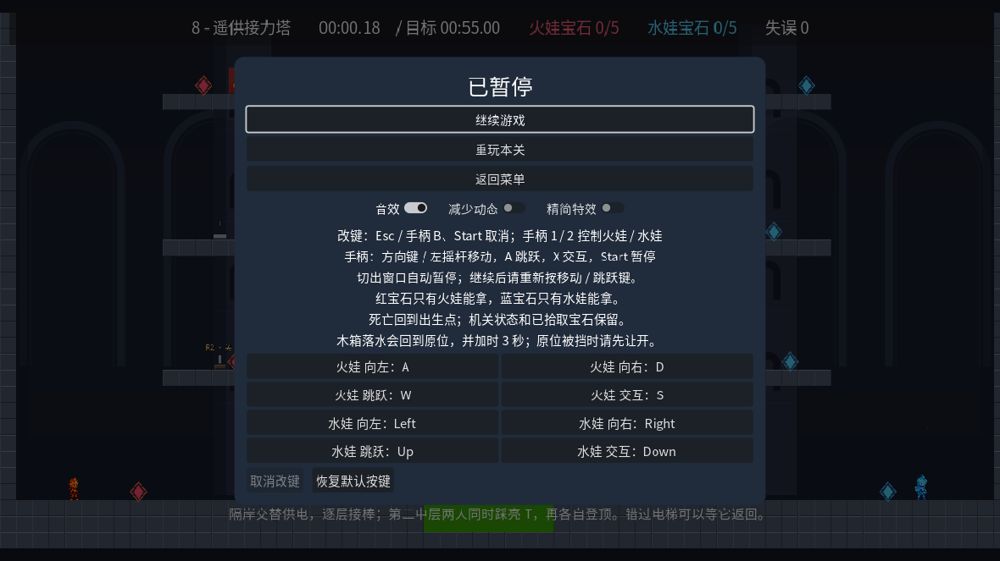
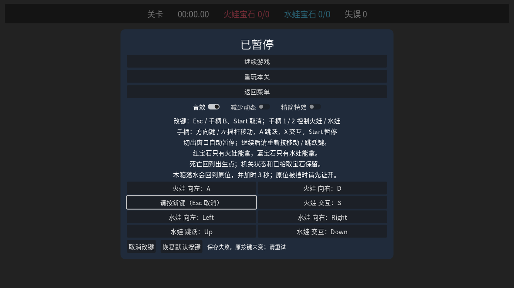
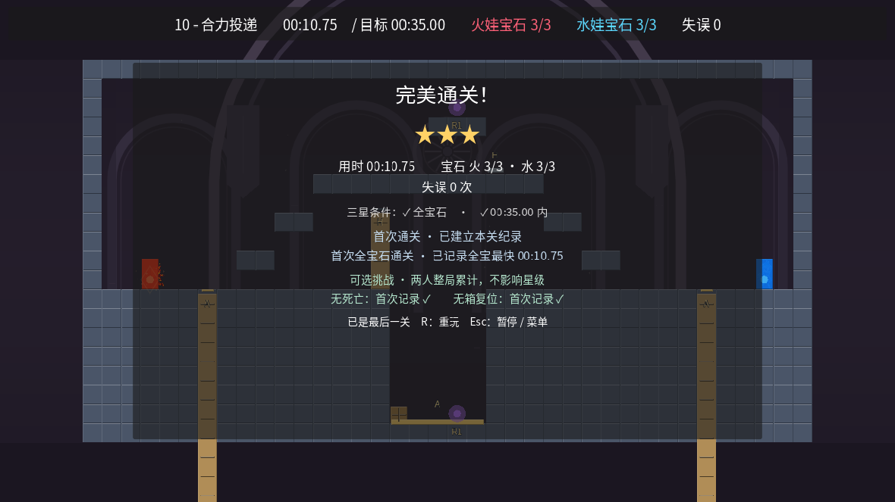
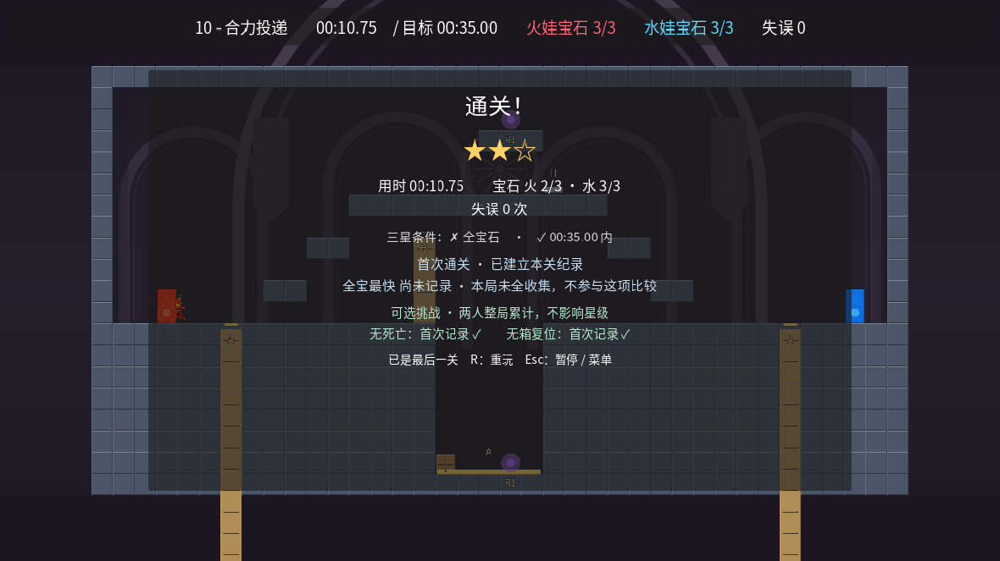

# 第六轮：暂停、改键与存档保护（2026-10-05）

基于 master `1d33f3485ff719853df17f68c4bd80062ecb6430`。继承本地已验证的输入/暂停修改后，在独立云端工程完成后续实现和验证；交付到新分支 `polish/control-flow-2026-10-05`，不合并、不部署。

## 修改范围

- **最后一颗宝石不再漏算**：最后宝石与出口同帧触发时，等该帧事件处理完再结算，统一保存、完成事件和面板的成绩快照；防止旧版出现顶栏已全宝、结算却少一颗和少一星。等待期间离场、死亡或重开不会误记通关。

- **切出窗口自动暂停**：正在游戏时失去焦点会暂停计时和物理，切回后等待手动继续。完成后的结算画面不自动改变。
- **继续游戏更稳**：暂停及继续时释放动作状态、清空角色跳跃缓冲，过滤 Godot 同帧释放后遗留的跳跃边沿；新的按下仍正常响应。没有调整角色速度、跳跃参数或操作难度。
- **改键可退出、可恢复**：键盘 Esc、任一手柄 Start/B、鼠标取消都能退出按键捕获；默认键位可恢复。校验动作名、键码、冲突和固定系统快捷键，保留有效自定义互换及双手柄事件。失败不会悄悄改变当前配置。
- **进度保护**：兼容原有存档路径与字段，写入临时文件并验证后替换，保留可恢复副本；损坏可选字段不再牵连有效成绩，异常版本不擅自降级覆盖。
- **验证入口**：保留 Windows UTF-8 控制台修复，新增专门回归，GitHub Actions 同时检查 Godot 4.6.3 与 4.7。

关卡布局、合作机关、三星门槛、内容修订号和评分/布局存档版本均保持不变。无死亡、无箱复位挑战仍按双人整局计算；缺失历史记录仍显示未知。

## 验证结果

- **Godot 4.6.3 与 4.7 默认完整入口均通过**：导入、静态检查、全部历史回归、新增回归、合作/恢复反例、十关冒烟和十关原始按键回放；没有跳过关卡或回放。
- 每个引擎新增/扩展覆盖：结算事件顺序 22、会话输入 33、改键 48、存档 24（另有真实 smoke 子进程 2）、菜单 249、场景流程 31 项检查，全部通过。
- **Godot 4.7 实际 OpenGL 图形验证通过**：UI、会话、改键、菜单、场景流转、机关反馈；十关图形原始回放全部全宝石、三星、零死亡、零箱复位，且逐关核对完成事件、最终状态和结算面板完全一致。
- **真实桌面焦点切换**：打开另一窗口后游戏自动暂停，计时冻结于 20.80 秒；关闭另一窗口、焦点回到游戏后仍保持暂停，明确按 Esc 才继续。
- 发布前核对最终运行时代码与双版本测试快照一致；关卡定义和原始回放文件相对基线没有改动。

可复核证据：[汇总与源码散列](qa/round6/verification.json)、[4.6.3 完整日志](qa/round6/full-checks-4.6.3.txt)、[4.7 完整日志](qa/round6/full-checks-4.7.txt)、[4.7 图形回放记录](qa/round6/raw-graphics-4.7.json)。

## 已知验证边界

云端验证平台为 Linux，键盘、鼠标和手柄输入通过 Godot/桌面事件验证。没有实体双手柄、macOS 或当前最终版本 Windows 人工试玩。已有 Windows 本地交接证据不是本次最终云端代码的完整通过证明。按键回放证明已记录十关路线可行，不替代真人双人难度评估或穷尽所有操作。

## 图形检查

以下为 Godot 4.7 在云端 OpenGL/llvmpipe 实际渲染的截图，不是界面草图。

图形检查使用 Dummy 音频后端；验证了音效逻辑，未验证硬件实际听感。首次图形环境探测的 ALSA 设备不可用错误已明确记录，没有将它算作无错误通过。

## 结算竞态的发现与回归

交付前逐张检查真实截图时，第十关曾出现顶栏火宝石 3/3、结算 2/3 的不一致。原回放验证器只在结束时重新计算成绩，因而漏掉了这个问题。本轮已经修复运行时结算顺序，并加强回放验证器：必须收到真实完成事件，且事件成绩、最终状态、面板宝石行和星级完全一致才通过。若最后输入恰好触发已排队的结算，只让既有延后调用处理完，不追加操作、不放宽原始输入帧数。

新增 22 项专门回归覆盖两种宝石/出口顺序、重复事件、离开出口、死亡、场景移除、存档一致性及完成事件观察者修改副本的隔离。最初暴露问题的旧测试通过记录不作为最终版本的证明；修复后双版本完整入口和图形十关回放重新执行。

GitHub CI 的快速首帧还暴露了旧反馈测试混用游戏帧时间与真实毫秒时钟的问题；仅将等待条件改为与 HUD 相同的单调时钟，保留全部 49 项断言，未更改反馈运行时逻辑。
